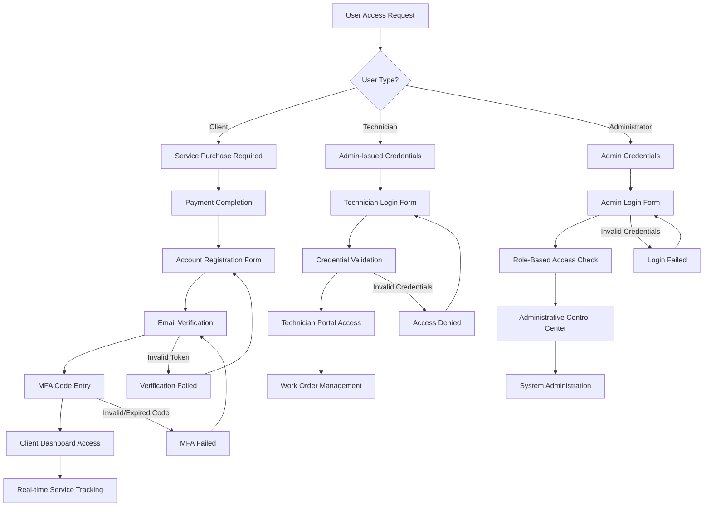
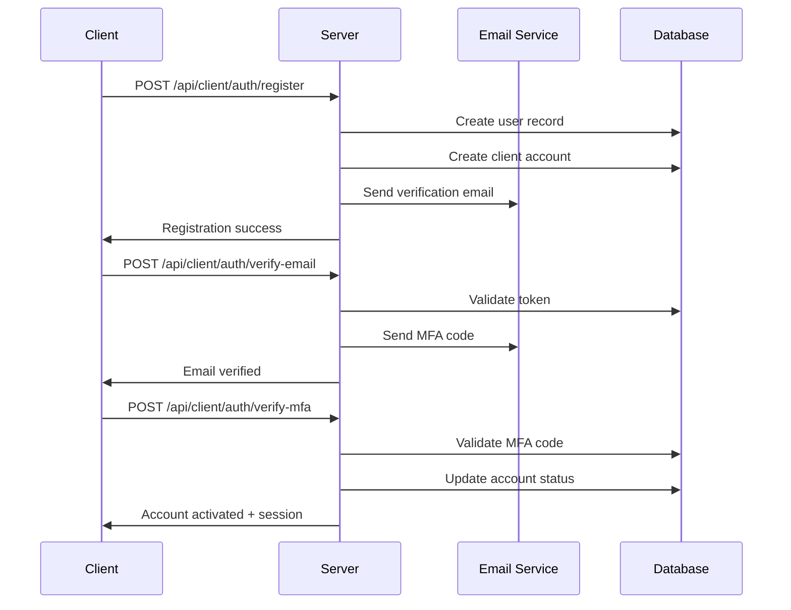
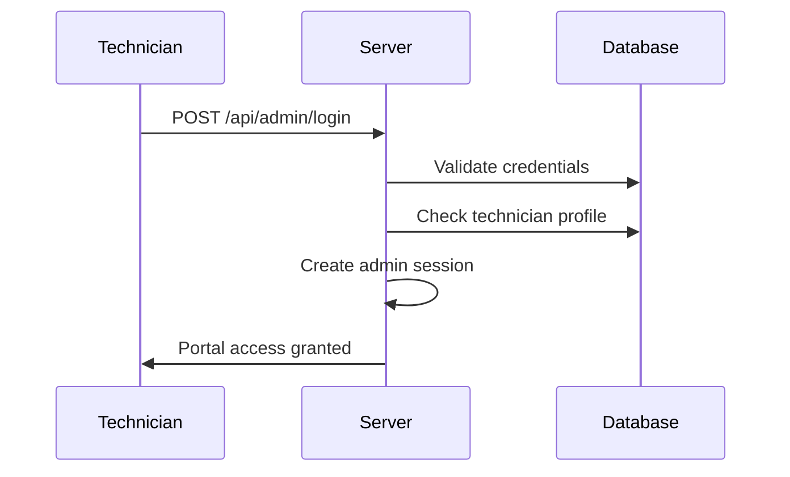
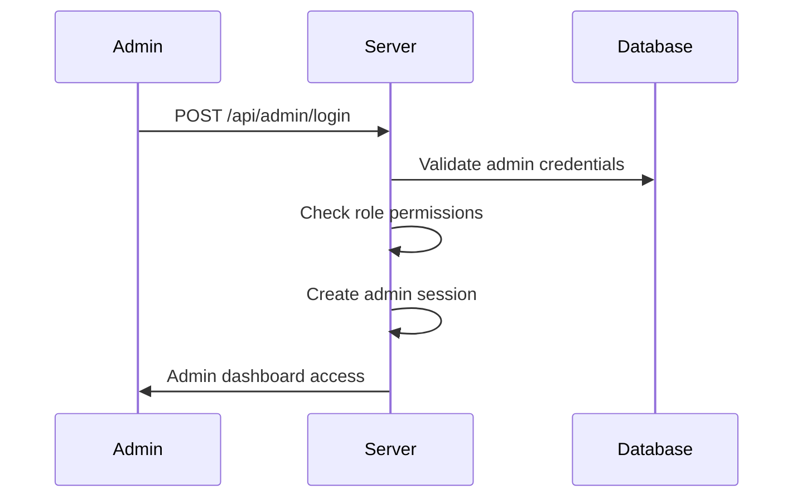

# CyberLockX System Architecture & Authentication Flow

## 🏗️ SYSTEM CLASS DIAGRAM

```mermaid
classDiagram
    %% Core User Management
    class Users {
        +id: number
        +username: string
        +password: string (hashed)
        +fullName?: string
        +email?: string
        +phone?: string
        +companyName?: string
        +role: string
        +isEmailVerified: boolean
        +mfaEnabled: boolean
        +lastLoginAt?: Date
        +createdAt: Date
        +updatedAt: Date
    }

    %% Client Account Management
    class ClientAccounts {
        +id: number
        +userId: number
        +serviceRequestId?: number
        +emailVerificationToken?: string
        +emailVerificationExpiry?: Date
        +mfaVerificationCode?: string
        +mfaVerificationExpiry?: Date
        +captchaVerified: boolean
        +accountCreatedFromPayment: boolean
        +paymentConfirmed: boolean
        +createdAt: Date
        +updatedAt: Date
    }

    %% Technician Profiles
    class TechnicianProfiles {
        +id: number
        +userId: number
        +techId: string
        +specializations: string[]
        +certifications: string[]
        +location: string
        +rating: number
        +status: string
        +createdAt: Date
        +updatedAt: Date
    }

    %% Service Requests
    class ServiceRequests {
        +id: number
        +companyName: string
        +contactName: string
        +contactEmail: string
        +contactPhone: string
        +serviceType: string
        +priority: string
        +status: string
        +scheduledDate?: Date
        +estimatedDuration?: number
        +totalCost?: number
        +description?: string
        +createdAt: Date
        +updatedAt: Date
    }

    %% Work Orders
    class WorkOrders {
        +id: number
        +serviceRequestId: number
        +technicianId?: number
        +status: string
        +scheduledDate?: Date
        +arrivedAt?: Date
        +departedAt?: Date
        +totalHoursWorked?: number
        +workDescription?: string
        +beforePhotos: string[]
        +afterPhotos: string[]
        +serviceReportFile?: string
        +clientSignature?: string
        +closingRemarks?: string
        +createdAt: Date
        +updatedAt: Date
    }

    %% Session Management
    class Sessions {
        +sid: string
        +sess: object
        +expire: Date
        +adminUser?: AdminSession
        +clientUser?: ClientSession
    }

    %% Admin Session Data
    class AdminSession {
        +id: number
        +username: string
        +role: string
        +fullName?: string
    }

    %% Client Session Data
    class ClientSession {
        +id: number
        +email: string
        +role: string
        +fullName?: string
    }

    %% Early Access Applications
    class EarlyAccessApplications {
        +id: number
        +fullName: string
        +companyName: string
        +email: string
        +companySize: string
        +currentChallenges: string
        +desiredOutcomes: string
        +contactPreference: string
        +status: string
        +createdAt: Date
        +updatedAt: Date
    }

    %% Visitor Analytics
    class VisitorSessions {
        +id: number
        +sessionId: string
        +ipAddress: string
        +userAgent: string
        +country?: string
        +city?: string
        +firstSeen: Date
        +lastSeen: Date
        +pageViews: number
        +isBot: boolean
    }

    %% Page Views
    class PageViews {
        +id: number
        +sessionId: string
        +visitorSessionId: number
        +path: string
        +referrer?: string
        +timestamp: Date
        +duration?: number
    }

    %% Relationships
    Users ||--o{ ClientAccounts : "user can have client account"
    Users ||--o{ TechnicianProfiles : "user can be technician"
    ClientAccounts }o--|| ServiceRequests : "linked to service request"
    ServiceRequests ||--o{ WorkOrders : "generates work orders"
    TechnicianProfiles ||--o{ WorkOrders : "assigned to work orders"
    Sessions ||--o{ AdminSession : "contains admin session"
    Sessions ||--o{ ClientSession : "contains client session"
    VisitorSessions ||--o{ PageViews : "tracks page views"
```

## 🔐 AUTHENTICATION FLOW DIAGRAM



## 🌐 URL ROUTING & ACCESS MATRIX

| URL | User Type | Authentication Required | Description |
|-----|-----------|------------------------|-------------|
| `/` | Public | No | Landing page |
| `/services` | Public | No | Service portal for purchases |
| `/client-login` | Client | No (Registration) | Client authentication |
| `/client-dashboard` | Client | Yes (Client Auth) | Service tracking dashboard |
| `/technician-login` | Technician | No (Login Form) | Technician authentication |
| `/technician` | Technician | Yes (Admin Auth) | Work order portal |
| `/admin/early-access` | Admin | Yes (Admin Auth) | Administrative control center |
| `/admin/analytics` | Admin | Yes (Admin Auth) | Analytics dashboard |

## 🔑 AUTHENTICATION MECHANISMS

### 1. Client Authentication System


### 2. Technician Authentication System


### 3. Admin Authentication System


## 🏛️ ROLE-BASED ACCESS CONTROL (RBAC)

### Role Hierarchy
```
Super Admin
    ├── Full system access
    ├── User management
    ├── System configuration
    └── Data export/import

Admin
    ├── Service management
    ├── Technician oversight
    ├── Client support
    └── Analytics access

Technician
    ├── Assigned work orders
    ├── Service reporting
    ├── Time tracking
    └── Client communication

Client
    ├── Service tracking
    ├── Document access
    ├── Technician communication
    └── Invoice/payment history

Viewer
    ├── Read-only access
    ├── Analytics viewing
    └── Report generation
```

## 🔄 SESSION MANAGEMENT

### Session Structure
```typescript
interface SessionData {
  adminUser?: {
    id: number;
    username: string;
    role: 'super_admin' | 'admin' | 'viewer';
    fullName?: string;
  };
  clientUser?: {
    id: number;
    email: string;
    role: 'client';
    fullName?: string;
  };
}
```

### Session Security Features
- **Secure Cookie Settings**: HTTP-only, secure, same-site
- **Session Expiration**: Configurable TTL with auto-renewal
- **Database Storage**: PostgreSQL-backed session store
- **Cross-Site Protection**: CSRF token validation
- **Session Invalidation**: Logout and timeout handling

## 📊 SECURITY MEASURES

### Client Security
- ✅ Email verification mandatory
- ✅ Multi-factor authentication (MFA)
- ✅ Password strength requirements
- ✅ Account lockout protection
- ✅ Session timeout management

### Technician Security
- ✅ Admin-issued credentials only
- ✅ Activity logging and monitoring
- ✅ Restricted work order access
- ✅ Secure file upload handling
- ✅ GPS/location tracking (future)

### Admin Security
- ✅ Role-based permissions
- ✅ Audit trail logging
- ✅ IP address monitoring
- ✅ Failed login detection
- ✅ Privilege escalation protection

## 🚀 API ENDPOINTS SUMMARY

### Client Authentication APIs
- `POST /api/client/auth/register` - Account registration
- `POST /api/client/auth/verify-email` - Email verification
- `POST /api/client/auth/verify-mfa` - MFA verification
- `POST /api/client/auth/login` - Client login
- `GET /api/client/auth/user` - Get current client user
- `POST /api/client/auth/logout` - Client logout
- `GET /api/client/service-data` - Client service tracking

### Admin/Technician APIs
- `POST /api/admin/login` - Admin/technician login
- `GET /api/admin/user` - Get current admin user
- `POST /api/admin/logout` - Admin logout
- `GET /api/technician/work-orders` - Technician work orders
- `PUT /api/technician/work-orders/:id` - Update work order

### Service Management APIs
- `GET /api/service-requests` - List service requests
- `POST /api/service-requests` - Create service request
- `PUT /api/service-requests/:id` - Update service request
- `GET /api/work-orders` - List work orders
- `POST /api/work-orders` - Create work order

## 📈 ANALYTICS & MONITORING

### Tracked Metrics
- User authentication events
- Session duration and activity
- Work order completion rates
- Client satisfaction scores
- System performance metrics
- Security incident detection

### Monitoring Dashboards
- Real-time user activity
- Service request pipeline
- Technician utilization
- Client engagement metrics
- System health indicators

---

*This documentation follows PRP 3.0 standards and provides comprehensive system architecture visibility for CyberLockX platform.*