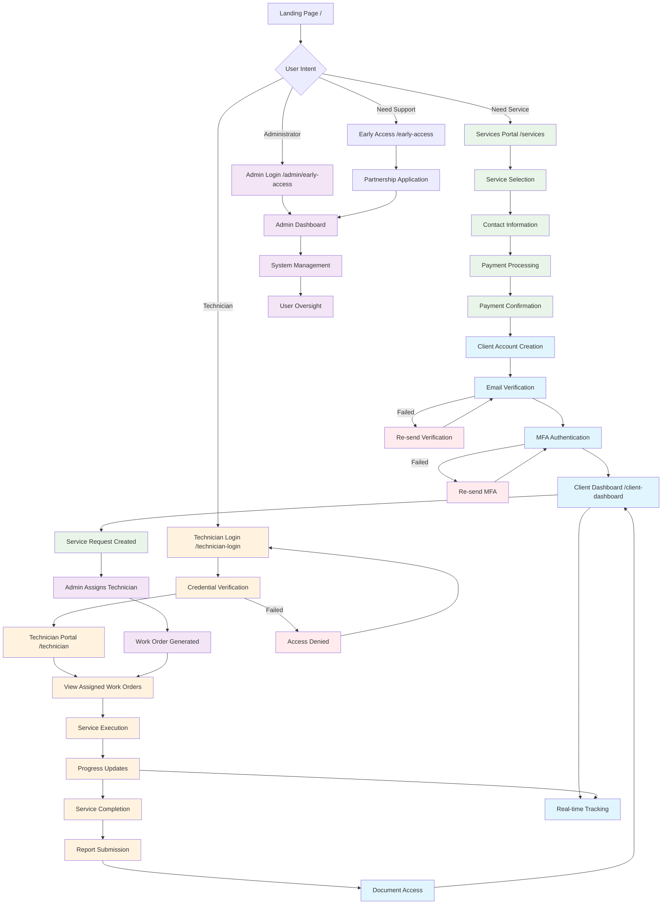
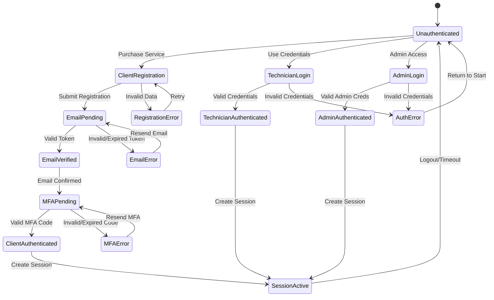
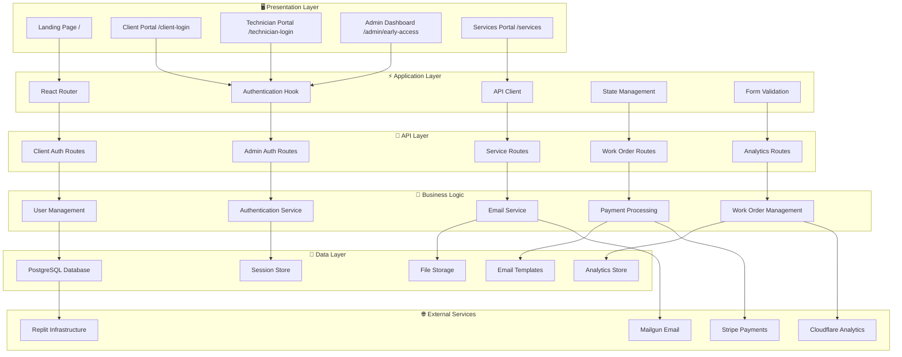
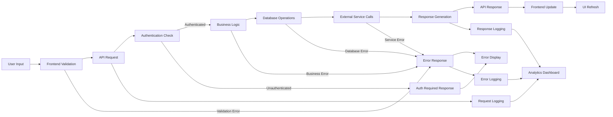
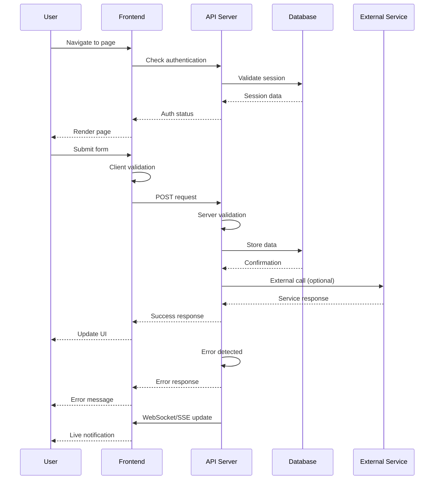
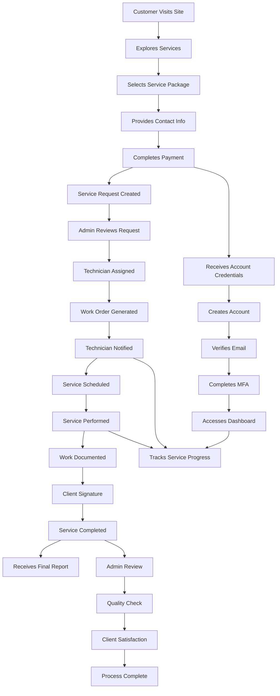

# 🎯 CyberLockX Complete System Flow Diagram

## 🌊 END-TO-END USER JOURNEY FLOW

## 🔐 AUTHENTICATION STATE MACHINE

## 🏗️ SYSTEM ARCHITECTURE LAYERS

## 📊 DATA FLOW DIAGRAM

## 🎭 USER INTERACTION PATTERNS

## 🔄 BUSINESS PROCESS FLOW

---

## 📋 SYSTEM INTEGRATION POINTS

### Frontend Integration
- **React Components**: Modular UI components
- **State Management**: React Query for API state
- **Routing**: Wouter for client-side navigation
- **Styling**: Tailwind CSS + shadcn/ui components

### Backend Integration
- **API Framework**: Express.js with TypeScript
- **Database**: PostgreSQL with Drizzle ORM
- **Authentication**: Session-based with bcrypt
- **File Handling**: Multer for uploads

### External Service Integration
- **Email**: Mailgun for transactional emails
- **Payments**: Stripe for service payments
- **Analytics**: Custom visitor tracking
- **Infrastructure**: Replit deployment platform

### Security Integration
- **HTTPS**: SSL/TLS encryption
- **CORS**: Cross-origin request security
- **CSRF**: Cross-site request forgery protection
- **Session**: Secure cookie-based sessions

---

*This comprehensive system flow documentation provides complete visibility into CyberLockX platform architecture and user interactions, following PRP 3.0 documentation standards.*